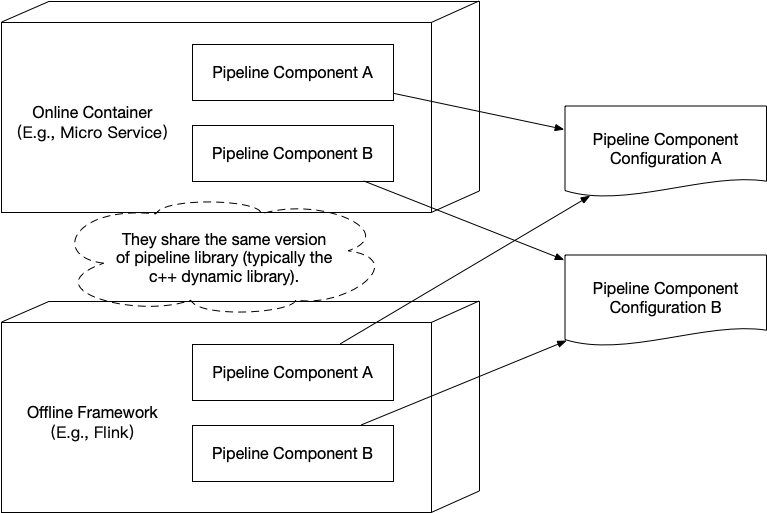

================================================
Introduction
================================================

This library was designed for high performance pipeline of feature transform and model prediction as a consistent
solution for both online and offline scenes.

The advantages are as follows.

(1) The users can deploy the same library and configuration files in both online and offline environments which
guarantees the computation consistency.

(2) To implement a large number of complex feature transforms and model predictions, the users only need to write a
few configuration files without hard code anything. We have predefined a lot of commonly useful attribute transforms,
feature transforms and model predictions (e.g., linear model and xgb model). In most of cases they will be enough.
The users can also define their own transforms if necessary.

(3) The library was implemented based on C++17 with thread pool support and efficient external libraries (e.g.,
google's SparseHash and Abseil) which implies the high performance of RT and QPS.

(4) We wrapped our library using Swig. This indicates that the users can deploy it in a large variety of containers
(e.g., Docker, Hadoop and Flink) with other programming languages (e.g., Java, Scala and Python) as invokers.

